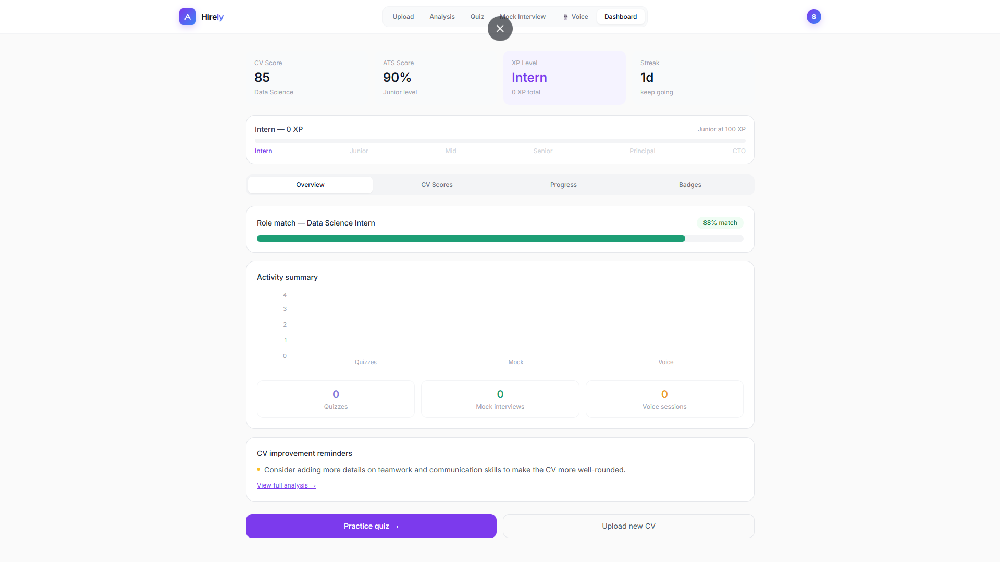
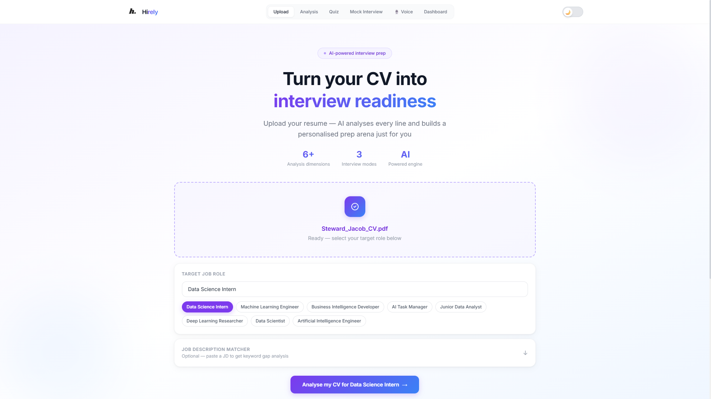
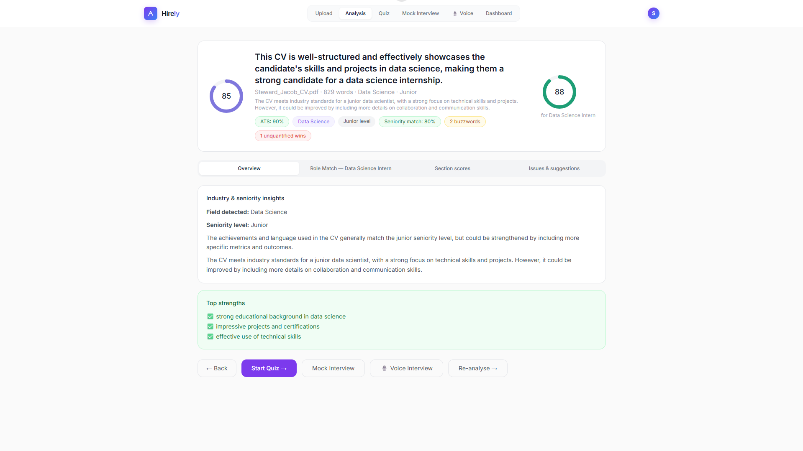
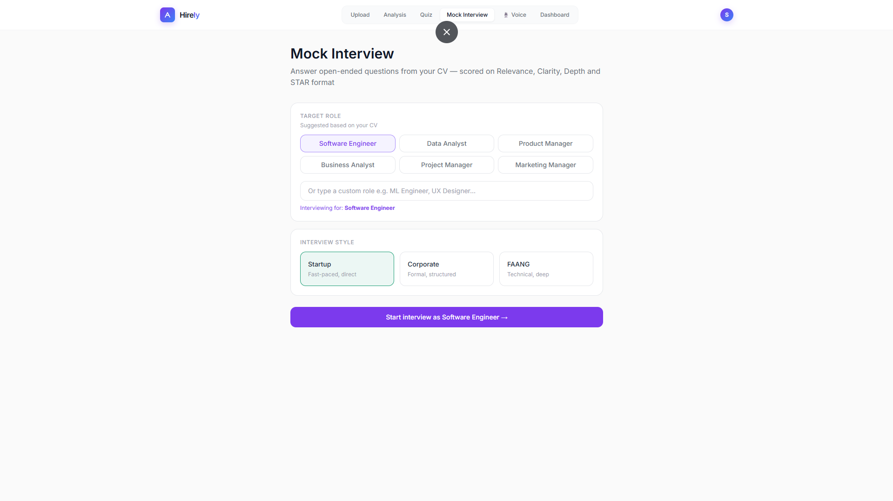

# Hirely

Hirely is a CV analysis and interview prep tool I built to help job seekers get actionable feedback on their resumes and practice interviews before the real thing.

Upload your CV, get an ATS score and detailed breakdown, then jump straight into mock interviews — text or voice — all powered by Groq's LLaMA model.

🔗 [Live Demo](https://cvforge-six.vercel.app)

---


*<!-- Add a screenshot of the dashboard here -->*

---

## What it does

**CV Analysis** — paste or upload your CV (PDF/DOCX) and get a health score, ATS compatibility rating, and specific suggestions broken down by section.

**Quiz Mode** — generates role-specific MCQs based on your CV content to test technical knowledge before an interview.

**Mock Interview (Text)** — AI asks you questions based on your profile, you type responses, and each answer gets STAR-format feedback with a score.

**Mock Interview (Voice)** — same flow as text but spoken. ElevenLabs handles the voice output so it actually feels like a real conversation.

**Dashboard** — tracks scores and performance across sessions using Recharts so you can see improvement over time.

---

## Screenshots

| CV Upload | Analysis |
|-----------|----------|
|  |  |

| Mock Interview | Dashboard |
|----------------|-----------|
|  |  |

*<!-- Replace the above paths with actual screenshots from your app -->*

---

## Stack

- **Frontend** — React, Tailwind CSS v3, Recharts → Vercel
- **Backend** — Node.js, Express, pdf-parse, Mammoth.js → Render
- **AI** — Groq API (`llama-3.3-70b-versatile`)
- **Voice** — ElevenLabs TTS

---

## Running locally

You'll need a Groq API key and an ElevenLabs API key before starting.

**Backend**

```bash
cd server
npm install
```

Create `server/.env`:

```
GROQ_API_KEY=your_key_here
ELEVENLABS_API_KEY=your_key_here
PORT=5000
```

```bash
npm start
```

**Frontend**

```bash
cd client
npm install
```

Create `client/.env`:

```
REACT_APP_API_URL=http://localhost:5000
```

```bash
npm start
```

App runs at `http://localhost:3000`.

---

## Notes

- `.env` files are gitignored — never commit your keys
- Render free tier spins down after inactivity; first request may take ~30s to wake up
- Voice interview requires mic permissions in the browser

---

## License

MIT
